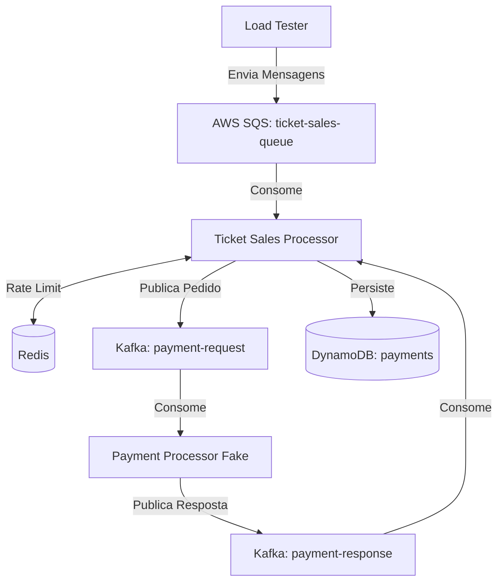

# Sistema de Processamento de Vendas de Ingressos

Este repositório contém um ecossistema completo para processamento de vendas de ingressos, focado em alta disponibilidade, resiliência e observabilidade. O sistema utiliza uma arquitetura baseada em eventos para gerenciar o fluxo de pagamentos de forma assíncrona e distribuída.

## 🏗️ Arquitetura do Sistema

O fluxo de dados segue o seguinte caminho:

1.  **Carga de Eventos (`load-tester`)**: Um utilitário que envia mensagens para uma fila SQS simulando a compra de ingressos por usuários.
2.  **Processador de Vendas (`ticket-sales-processor`)**: Aplicação Spring Boot que consome mensagens do SQS. Ela implementa **Rate Limiting Distribuído** usando Bucket4j e Redis para controlar a vazão de pagamentos. Após a validação, envia uma solicitação de pagamento para um tópico Kafka.
3.  **Processador de Pagamentos Fake (`payment-processor-fake`)**: Aplicação em Go que consome solicitações do Kafka, simula um processamento externo e devolve o resultado (Sucesso/Falha) em outro tópico Kafka.
4.  **Finalização**: O `ticket-sales-processor` escuta o retorno do Kafka e atualiza o status do pagamento no DynamoDB.



## 🛠️ Tecnologias Utilizadas

-   **Linguagens**: Java 21 (Spring Boot), Go 1.22
-   **Mensageria**: AWS SQS (via Localstack), Apache Kafka
-   **Banco de Dados**: DynamoDB (via Localstack), Redis (para Rate Limit)
-   **Resiliência**: Bucket4j (Token Bucket)
-   **Observabilidade**: OpenTelemetry (OTel), Prometheus, Grafana, Loki, Tempo

## 🚀 Como Executar

### Pré-requisitos
-   Docker e Docker Compose instalados.

### Passo a Passo

1.  **Subir a infraestrutura e aplicações**:
    ```bash
    docker-compose up -d
    ```

2.  **Verificar o status dos serviços**:
    As aplicações estarão rodando após alguns segundos. Você pode conferir os logs com:
    ```bash
    docker-compose logs -f
    ```

3.  **Acessar a Observabilidade**:
    -   **Grafana**: [http://localhost:3000](http://localhost:3000) (Dashboard pré-configurado disponível).
    -   **Prometheus**: [http://localhost:9090](http://localhost:9090)

## 📊 Observabilidade

O projeto já vem configurado com uma stack completa de observabilidade:
-   **Métricas**: Exportadas via OTel para Prometheus.
-   **Logs**: Coletados pelo Promtail e enviados para o Loki.
-   **Rastreamento (Tracing)**: Traces distribuídos enviados para o Tempo, permitindo ver o caminho completo de uma requisição do SQS ao Kafka.

Confira os Dashboards no Grafana para visualizar o throughput, latência e o estado dos tokens do Bucket4j.

## 📂 Estrutura do Repositório

-   [`/ticket-sales-processor`](./ticket-sales-processor): Core da aplicação (Java).
-   [`/payment-processor-fake`](./payment-processor-fake): Simulador de pagamentos (Go).
-   [`/load-tester`](./load-tester): Ferramenta para geração de carga (Go).
-   [`/observability`](./observability): Configurações de monitoramento.
-   [`/docs`](./docs): Documentação detalhada e guias para agentes de IA.

---
Para detalhes técnicos específicos de cada componente, consulte os READMEs dentro de suas respectivas pastas.
