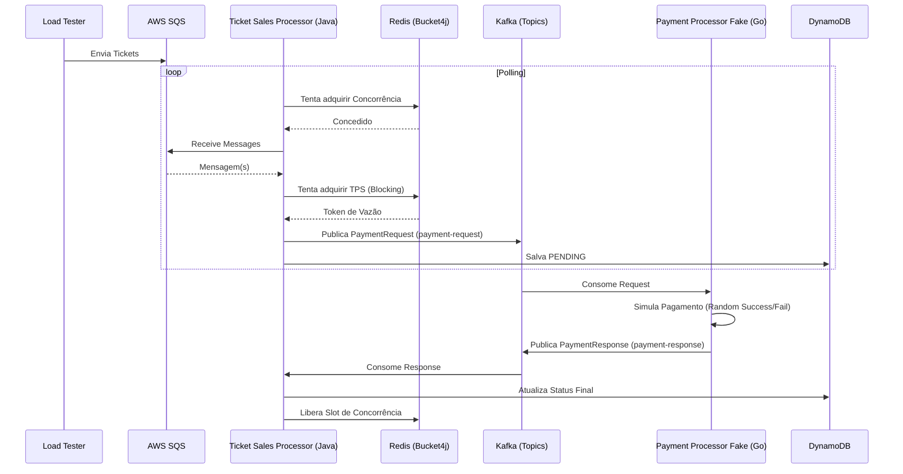

# 🏛️ Arquitetura do Sistema

Este documento fornece uma visão detalhada da arquitetura técnica e das decisões de design tomadas para o sistema de processamento de ingressos.

## 🌉 Fluxo de Dados e Mensageria

O sistema foi desenhado para ser totalmente assíncrono e baseado em eventos para garantir resiliência e evitar o acoplamento temporal entre componentes.

### 1. Ingestão de Dados (SQS)
As mensagens chegam através de uma fila SQS (`ticket-sales-queue`). O uso de SQS permite um buffer natural para picos de tráfego (load spikes).
- **Consumidor**: `ticket-sales-processor` (Java).
- **Padrão**: *Guarded Polling*. Antes de cada `receiveMessage`, o consumidor verifica se há "slots" de concorrência disponíveis no Redis.

### 2. Orquestração e Rate Limiting (Java)
O `ticket-sales-processor` atua como o core inteligente.
- **Bucket4j + Redis**: Gerencia dois baldes (Buckets):
    - **Concurrency Bucket**: Limita o número de mensagens em processamento simultâneo (in-flight). Garante que o sistema não sature recursos de I/O.
    - **Rate Limit Bucket**: Garante que a saída (pedidos para o Kafka) seja linear (TPS estável), prevenindo sobrecarga em gateways de pagamento externos.
- **Kafka Producer**: Transforma a mensagem do SQS em um `PaymentRequest` e publica no Kafka.

### 3. Processamento de Pagamento (Kafka + Go)
O processamento de pagamento ocorre de forma assíncrona.
- **Kafka Topics**:
    - `payment-request`: Solicitações saindo do Java para o Go.
    - `payment-response`: Respostas voltando do Go para o Java.
- **Consumidor Go**: Escala horizontalmente (3 réplicas padrão no Docker Compose) para processar as solicitações rapidamente.

### 4. Persistência e Callback (DynamoDB)
- **Status Inicial**: `PENDING` (Salvo assim que o Java envia para o Kafka).
- **Status Final**: `SUCCESS` ou `FAILED` (Atualizado quando a resposta do Kafka chega).
- **Liberando Concorrência**: O slot de concorrência do Redis só é liberado após o `PaymentResponseListener` processar a resposta do Kafka, completando o ciclo de vida da transação.

## 🧱 Componentes da Infraestrutura

| Componente | Função |
| :--- | :--- |
| **Kafka** | Barramento de eventos de baixa latência. |
| **Redis** | Estado compartilhado para Rate Limiting distribuído. |
| **DynamoDB** | Persistência de longa duração de estados de transação. |
| **Localstack** | Mock de serviços AWS (SQS, DynamoDB). |
| **OTel Collector** | Centralizador de Telemetria (Metrics, Traces, Logs). |

## 📐 Diagrama de Sequência

## 🛡️ Decisões de Design (ADRs)

1. **Uso de Virtual Threads**: Escolhido para lidar com milhares de tarefas de polling do SQS e Kafka de forma leve, sem o overhead de gerenciar pools de threads nativas do SO.
2. **Rate Limit Distribuído**: Essencial para garantir que, mesmo escalando o `ticket-sales-processor` para múltiplas réplicas (como as 3 no Docker Compose), o limite global de TPS seja respeitado.
3. **Async Responses**: Ao invés de esperar o Kafka responder de forma síncrona, usamos um listener separado para liberar recursos, aumentando massivamente o throughput do orquestrador.
